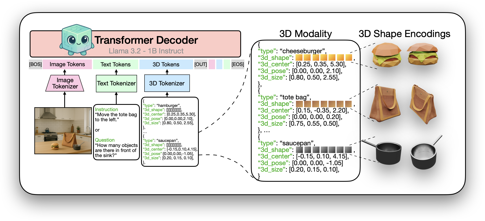

# Aligning Text, Images, and 3D Structure Token-by-Token

This repository contains the official code for the paper [**Aligning Text, Images, and 3D Structure Token-by-Token**](https://glab-caltech.github.io/kyvo/).  
**Authors:** [Aadarsh Sahoo](https://aadsah.github.io/), [Vansh Tibrewal](https://vanshtibrewal.github.io/), [Georgia Gkioxari](https://gkioxari.github.io/)  


<p align="center">
  <a href="https://glab-caltech.github.io/kyvo/">
    
  </a>
  <a href="https://arxiv.org/abs/2506.08002">
    
  </a>
  <a href="https://huggingface.co/datasets/aadarsh99/kyvo-datasets-and-codebooks">
    
  </a>
  <a href="#citation">
    
  </a>
</p>


<p align="center">
  
</p>
<p align="center"><em><b>Kyvo:</b> a decoder-only transformer aligns a structured 3D modality with language and vision.
              This 3D modality represents scenes as lists of objects, each defined by its 3D shape, type, 3D position,
              pose and size parameters. Kyvo unifies the token space of images, text, and 3D to enable a variety of
              complex visual 3D tasks.</em></p>


---

## Table of Contents
1. [Setup](#setup)
2. [Dataset and VQGAN Codebooks](#dataset-and-vqgan-codebooks)
3. [Download Llama-3.2-1B Models](#download-llama-3.2-1b-models)
4. [Training](#training)
5. [Evaluation](#evaluation)

---

## 📢 News
- **2025-06-09**: Kyvo is on arXiv!

## 📋 TODO
- [ ] Release code and data for ARKitScenes and ObjaWorld with explicit shape representations.
- [ ] HuggingFace 🤗 demo. 
- [x] Release training code and data for CLEVR, ObjaWorld (complex object shapes), Objectron.

## Setup

This repository uses [torchtune](https://github.com/pytorch/torchtune) for training, included as a submodule.

1. **Clone this repository**:

   ```bash
   git clone --recurse-submodules https://github.com/AadSah/kyvo.git
   cd kyvo
    ```

2. **Set up the environment:**:

    **Option A:** Create a new conda environment and install the required dependencies:

    ```bash
    cd kyvo
    conda create -n kyvo python=3.11
    conda activate kyvo
    cd torchtune
    pip install -e .
    cd ..
    pip install -r requirements.txt
    ```

    **Option B:** Use the provided conda environment file to create the environment:

    ```bash
    conda env create -f kyvo.yml
    conda activate kyvo
    cd torchtune
    pip install -e .
    cd ..
    ```

## Dataset and VQGAN Codebooks

Download the pre-tokenized data, VQGAN checkpoints, and codebooks from Hugging Face:

```bash
git clone git@hf.co:datasets/aadarsh99/kyvo-datasets-and-codebooks
cd kyvo-datasets-and-codebooks
git lfs install
git pull
```

This will create a folder `./kyvo-datasets-and-codebooks` with the following structure:

```python
kyvo-datasets-and-codebooks/
|-- images-and-scenes-for-evaluation/ # contains all images and scenes for evaluation
|   |-- clevr/ # all CLEVR related files
|   |-- objaworld/ # all ObjaWorld related files
|   | ...
|-- pretokenized-data/ # contains all pre-tokenized data for all the datasets
|-- |-- clevr/ # all CLEVR related files
|   |-- objaworld/ # all ObjaWorld related files
|   | ...
|-- vqgan-models-and-codebooks/ # contains all VQGAN model checkpoints and codebooks
|   |-- clevr/ # all CLEVR related files
|   |-- objaworld/ # all ObjaWorld related files
|   | ...
```

More details about the dataset and VQGAN codebooks can be found in the [`DATA.md`](DATA.md) file.

## Download Llama-3.2-1B Models

Use `tune download` to fetch the Llama-3.2-1B models:

```bash
tune download meta-llama/Llama-3.2-1B --output-dir ./llama-3-models/Llama3.2-1B/

tune download meta-llama/Llama-3.2-1B-Instruct --output-dir ./llama-3-models/Llama3.2-1B-Instruct/
```

For convenience and compatibility with the provided config files, you may need to restructure the downloaded model directories (otherwise, update paths in your config files accordingly):

```bash
mv ./llama-3-models/Llama3.2-1B/original/* ./llama-3-models/Llama3.2-1B/

mv ./llama-3-models/Llama3.2-1B-Instruct/original/* ./llama-3-models/Llama3.2-1B-Instruct/
```

## Training

All training configuration files are located in `./configs/llama3_2/train/`. Below are sample commands for different datasets and tasks:

### CLEVR:

```bash
# Rendering
python3 scripts/full_finetune_single_device_3d.py --config ./kyvo/configs/llama3_2/train/clevr/rendering.yaml

# Recognition
python3 scripts/full_finetune_single_device_3d.py --config ./kyvo/configs/llama3_2/train/clevr/recognition.yaml

# Instruction-Following
python3 scripts/full_finetune_single_device_3d.py --config ./kyvo/configs/llama3_2/train/clevr/instruction_following.yaml

# Question-Answering
python3 scripts/full_finetune_single_device_3d.py --config ./kyvo/configs/llama3_2/train/clevr/question_answering.yaml
```

### ObjaWorld:

```bash
# Rendering
python3 scripts/full_finetune_single_device_3d.py --config ./kyvo/configs/llama3_2/train/objaworld/rendering.yaml

# Recognition
python3 scripts/full_finetune_single_device_3d.py --config ./kyvo/configs/llama3_2/train/objaworld/recognition.yaml
```

### Objectron:

```bash
# Recognition
python3 scripts/full_finetune_single_device_3d.py --config ./kyvo/configs/llama3_2/train/objectron/recognition.yaml
```

After training, the models will be saved in the `./checkpoints/` directory.

## Evaluation

Evaluation configuration files are located in `./configs/llama3_2/eval/`. Below are sample commands:

### CLEVR:

```python
# Rendering
python3 scripts/generate_3d.py --config ./kyvo/configs/llama3_2/eval/clevr/rendering.yaml

# Recognition
python3 scripts/generate_3d.py --config ./kyvo/configs/llama3_2/eval/clevr/recognition.yaml

# Instruction-Following (5 sub-tasks are individually evaluated)
python3 scripts/generate_3d.py --config ./kyvo/configs/llama3_2/eval/clevr/instruction-following/appearance-no-relation.yaml
python3 scripts/generate_3d.py --config ./kyvo/configs/llama3_2/eval/clevr/instruction-following/appearance-with-relation.yaml
python3 scripts/generate_3d.py --config ./kyvo/configs/llama3_2/eval/clevr/instruction-following/insertion-with-relation.yaml
python3 scripts/generate_3d.py --config ./kyvo/configs/llama3_2/eval/clevr/instruction-following/moving-with-relation.yaml
python3 scripts/generate_3d.py --config ./kyvo/configs/llama3_2/eval/clevr/instruction-following/removal-with-relation.yaml

# Question-Answering
python3 scripts/generate_3d.py --config ./kyvo/configs/llama3_2/eval/clevr/question-answering.yaml
```

### ObjaWorld:

```python
# Rendering
python3 scripts/generate_3d.py --config ./kyvo/configs/llama3_2/eval/objaworld/rendering.yaml

# Recognition
python3 scripts/generate_3d.py --config ./kyvo/configs/llama3_2/eval/objaworld/recognition.yaml
```

### Objectron:

```python
# Recognition
python3 scripts/generate_3d.py --config ./kyvo/configs/llama3_2/eval/objectron/recognition.yaml
```

Evaluation outputs are saved (by default) to `./checkpoints/` or a directory specified in the config files. Depending on the task, outputs may include 3D scene JSONs, image embeddings, or text predictions.


### Metrics Computation

Below are scripts for computing the evaluation metrics used in the paper.

1. **Jaccard Index on 3D Scenes**

    ```bash
    # CLEVR
    python3 scripts/compute_jaccard_index.py --tau 0.05 --generated_folder ./checkpoints/clevr/recognition-inference/three_d_json/clevr_recognition_inference --groundtruth_folder ./kyvo-datasets-and-codebooks/images-and-scenes-for-evaluation/clevr/original_images/scenes --dataset clevr

    # ObjaWorld
    python3 scripts/compute_jaccard_index.py --tau 0.05 --generated_folder ./checkpoints/objaworld/recognition-inference/three_d_json/objaworld_recognition_inference --groundtruth_folder ./kyvo-datasets-and-codebooks/images-and-scenes-for-evaluation/objaworld/original_images/ --dataset objaworld

    # Objectron (kyvo)
    python3 scripts/compute_jaccard_index.py --tau 0.05 --dimension_tau 0.05 --predictions_file ./checkpoints/objectron/recognition-inference/three_d_json/objectron_recognition_inference/predicted_scenes_objectron_recognition_inference.json --groundtruth_file kyvo-datasets-and-codebooks/images-and-scenes-for-evaluation/objectron/Objectron_test.json --dataset objaworld --method kyvo

    # Objectron (Cube-RCNN)
    python3 scripts/compute_jaccard_index.py --tau 0.05 --dimension_tau 0.05 --predictions_file kyvo-datasets-and-codebooks/images-and-scenes-for-evaluation/objectron/omni_instance_results_resnet34.json --groundtruth_file kyvo-datasets-and-codebooks/images-and-scenes-for-evaluation/objectron/Objectron_test.json --dataset objaworld --method cube-rcnn
    ```
    * `--tau`: Threshold for Jaccard index.
    * `--generated_folder`: Path to predicted 3D scenes.
    * `--groundtruth_folder`: Path to ground truth 3D scenes.
    * `--dataset`: Dataset name.

2. **Decoding Image Embeddings and Computing SSIM / L2-Loss**

    Create a separate environment to install [`taming-transformers`](https://github.com/CompVis/taming-transformers/tree/master):

    ```bash
    conda env create -f taming-kyvo.yml
    conda activate taming-kyvo
    cd taming-transformers
    pip install -e .
    cd ..
    ```

    **Decode Image Embeddings:**

    ```bash
    # CLEVR
    python3 scripts/decode_image_embeddings.py --vqgan_type clevr --folder_path ./checkpoints/clevr/rendering-inference/image_embeddings/clevr_rendering_inference --image_output_path ./checkpoints/clevr/rendering-inference/decoded_images/

    # ObjaWorld
    python3 scripts/decode_image_embeddings.py --vqgan_type objaworld --folder_path ./checkpoints/objaworld/rendering-inference/image_embeddings/objaworld_rendering_inference --image_output_path ./checkpoints/objaworld/rendering-inference/decoded_images/
    ```

    * `--folder_path`: Path to image embeddings.
    * `--vqgan_type`: Dataset name.
    * `--image_output_path`: Path to save decoded images.

    **Compute SSIM and L2-Loss:**

    ```bash
    # CLEVR
    python3 scripts/compute_ssim_l2loss.py --generated_folder ./checkpoints/clevr/rendering-inference/decoded_images/GENERATED --groundtruth_folder ./kyvo-datasets-and-codebooks/images-and-scenes-for-evaluation/clevr/original_images/images --output_folder ./checkpoints/clevr/rendering-inference/decoded_images
    ```

    * `--generated_folder`: Path to predicted images.
    * `--groundtruth_folder`: Path to ground truth images.
    * `--output_folder`: Path to save computed SSIM and L2-loss values.

3. **Text Output Accuracy**

    ```bash
    python3 scripts/compute_text_answer_accuracy.py --predicted_file ./checkpoints/clevr/question-answering-inference/three_d_json/clevr_question-answering_inference/predicted_answers_clevr_question-answering_inference.json --groundtruth_file ./kyvo-datasets-and-codebooks/pretokenized-data/clevr/text/test_vqa_answers.json
    ```

    * `--predicted_file`: Path to predicted text answers.
    * `--groundtruth_file`: Path to ground truth text answers.

---

## Citation

If you find this work useful, please consider citing:

```bibtex
@misc{sahoo2025aligningtextimages3d,
  title={Aligning Text, Images, and 3D Structure Token-by-Token}, 
  author={Aadarsh Sahoo and Vansh Tibrewal and Georgia Gkioxari},
  year={2025},
  eprint={2506.08002},
  archivePrefix={arXiv},
  primaryClass={cs.CV},
  url={https://arxiv.org/abs/2506.08002}, 
}
```

---

For any questions or issues, please open a GitHub issue or contact [Aadarsh](mailto:aadarsh.sahoo.99@gmail.com). Thank you for your interest in our work!


